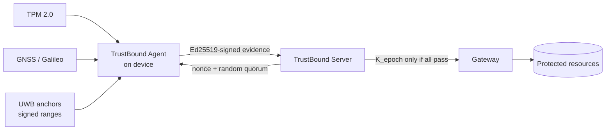
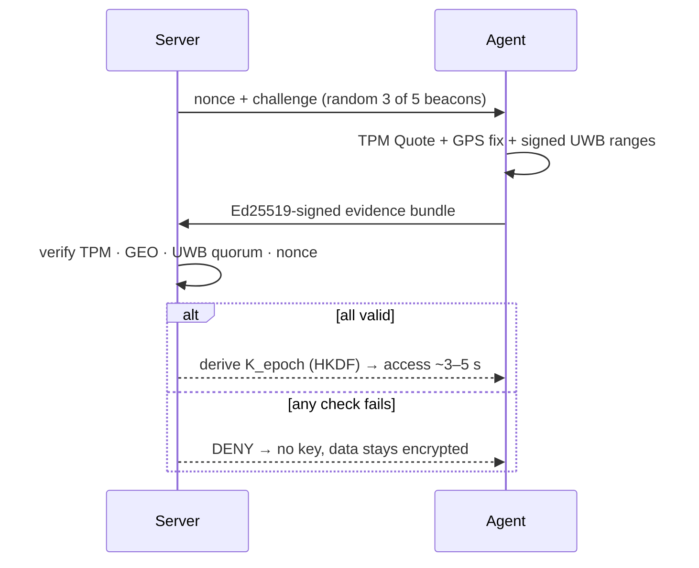
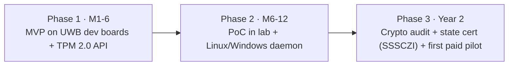

# TrustBound

**Continuous spatial & hardware authentication for Zero Trust architectures.**

> The physical perimeter is the new cryptographic boundary — we don't trust a device until we can mathematically prove *exactly where it is*.

🌐 Live site & interactive demo: **https://trustbound.forum** · ✉️ **trustbound67@gmail.com**
🇬🇧 English (this branch `en`) · 🇺🇦 Ukrainian: branch [`uk`](../../tree/uk)

---

## The problem

Identity & Access Management verifies you **once, at login** — then goes blind to the device's physical movement. With valid credentials, a live session and an intact TPM, an attacker can carry an unlocked laptop out of a secure zone and keep full access. Manual revocation takes hours to days; a single R&D leak costs millions.

## The idea

Access is not a door you open once — it's a **stream you must keep earning**. Every ~3–5 seconds the device must re-prove **three independent facts**:

| Layer | Technology | Proves |
|-------|-----------|--------|
| Hardware root of trust | **TPM 2.0** (PCR, TPM Quote, EK/AK) | Same, untampered device |
| Macro-location | **GNSS / Galileo** (+ OSNMA) | In the allowed building / geofence |
| Micro-positioning | **UWB** (IEEE 802.15.4z, ToF, STS) | Physically in this room, now |

## Architecture

## How verification works (every ~3–5 s)

Leave the room → the beacons can't confirm presence → the next key `K_epoch` is never derived → access dies in seconds and resources stay encrypted (AES-256-GCM).

## Two core innovations

- **Random Witness Quorum** — the server randomly picks a subset of UWB beacons each round (e.g. 3 of 5). You can't pre-forge what you can't predict; to fool it you'd need every beacon at once.
- **Presence-Bound Key Stream** — short-lived keys derived via **HKDF-SHA256** *only* when TPM + GEO + UWB quorum + a fresh server challenge all pass. No proof → no key.

## Technology

- **Crypto:** Ed25519 (signatures), HKDF-SHA256 + HMAC-SHA256 (key stream), AES-256-GCM (sealing), TLS 1.3 mTLS; PQC-ready (ML-KEM / ML-DSA).
- **Hardware:** TPM 2.0, GNSS/Galileo receiver, UWB radio (IEEE 802.15.4z / FiRa), beacons with Secure Element keys.
- **Software:** client agent + central server — Python (FastAPI), hot paths in Go/Rust, C/C++ for TPM (TSS/tpm2-tools) and UWB; deployed in **Docker**; tamper-evident audit (hash chain).

## Attack resistance

| Attack | Why it fails |
|--------|--------------|
| 🚪 Device theft | Out of room → no UWB quorum → no key |
| 🛰 GPS spoofing | UWB needs signed in-room replies; Galileo OSNMA flags forgery |
| 🧬 Boot/TPM tampering | PCR ≠ golden values → TPM Quote fails |
| 📡 Beacon jamming | Random k-of-n quorum → must jam all; else fail-secure |
| ⏪ Replay / MITM | Fresh nonce + epoch, mTLS, Ed25519 signatures |

## The website — trustbound.forum

A multi-page bilingual (UA/EN) product site with a **live interactive demo** (`/program/`): drag a laptop around a room and watch access revoke in real time, with **real in-browser cryptography** (HKDF · Ed25519 · AES-GCM). Pages: Home, Benefits, **Tech** (full deep-dive), Implementation (the demo). Served over HTTPS (Let's Encrypt) on an Ubuntu/Nginx VPS.

## Standards & standardization

Built on open standards and mapped onto Zero Trust models — see **[docs/STANDARDS.md](docs/STANDARDS.md)**.

## Team

Cadets of the Institute of Special Communications and Information Protection (ISCIP), Igor Sikorsky Kyiv Polytechnic Institute — major **Cybersecurity**, CTF team **LeetSh4d0ws**.

---
*Status: early R&D / pre-seed. Concept + working demo. Grounded in NIST SP 800-207 and the DoD Zero Trust Strategy.*
