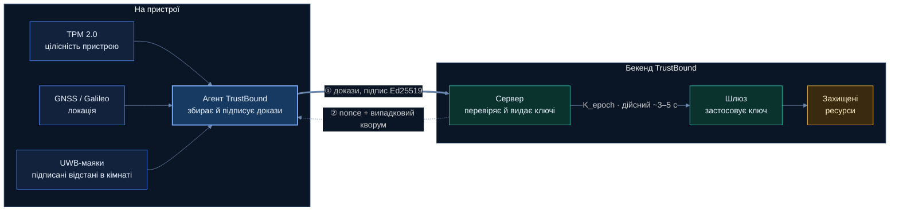
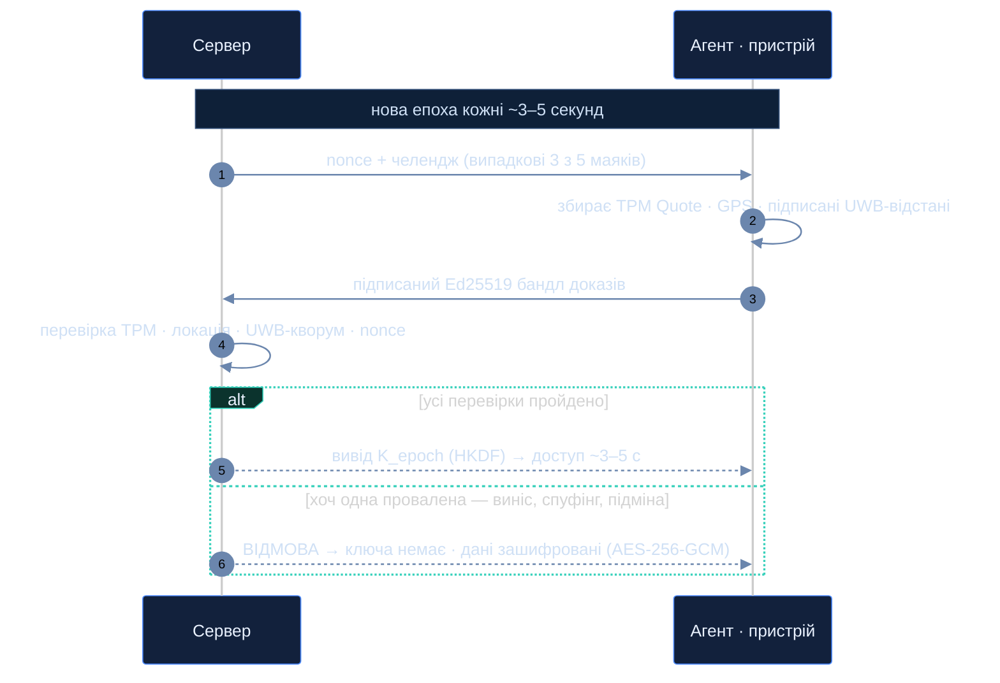
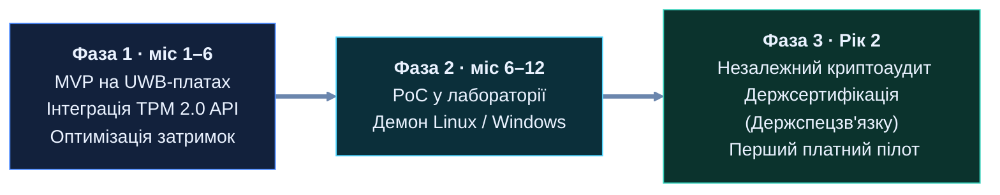

# TrustBound

**Неперервна просторова та апаратна автентифікація для архітектур нульової довіри (Zero Trust).**

> Фізичний периметр — це новий криптографічний кордон: ми не довіряємо пристрою, доки математично не доведемо, *де саме він знаходиться*.

🌐 Сайт і живе демо: **https://trustbound.forum** · ✉️ **trustbound67@gmail.com**
🇺🇦 Українською (ця гілка `uk`) · 🇬🇧 English: гілка [`en`](../../tree/en)

---

## Проблема

Класичний контроль доступу перевіряє вас **один раз — на вході**, а далі не бачить фізичного руху пристрою. Маючи валідні облікові дані, активну сесію й непошкоджений TPM, зловмисник може винести розблокований ноутбук із захищеної зони й зберегти повний доступ. Ручне відкликання триває години-дні; один витік R&D коштує мільйони.

## Ідея

Доступ — це не двері, які відчинили раз, а **потік, який треба постійно заслуговувати**. Кожні ~3–5 секунд пристрій мусить наново довести **три незалежні факти**:

| Рівень | Технологія | Що доводить |
|--------|-----------|-------------|
| Апаратний корінь довіри | **TPM 2.0** (PCR, TPM Quote, EK/AK) | Той самий, непідмінений пристрій |
| Макро-локація | **GNSS / Galileo** (+ OSNMA) | У дозволеній будівлі / геозоні |
| Мікропозиціювання | **UWB** (IEEE 802.15.4z, ToF, STS) | Фізично в цій кімнаті, зараз |

## Архітектура

## Як працює перевірка (кожні ~3–5 с)

Вийшов із кімнати → маяки не підтверджують присутність → наступний ключ `K_epoch` не виводиться → доступ гасне за секунди, а дані лишаються зашифрованими (AES-256-GCM).

## Дві ключові інновації

- **Random Witness Quorum** — сервер щоразу випадково обирає підмножину маяків (напр. 3 з 5). Не можна підробити те, чого не передбачив; щоб обдурити, треба контролювати всі маяки одночасно.
- **Presence-Bound Key Stream** — короткоживучі ключі виводяться через **HKDF-SHA256** *лише* коли TPM + GEO + UWB-кворум + свіжий серверний челендж усі пройшли. Немає доказу → немає ключа.

## Технології

- **Криптографія:** Ed25519 (підписи), HKDF-SHA256 + HMAC-SHA256 (потік ключів), AES-256-GCM (шифрування), TLS 1.3 mTLS; готовність до PQC (ML-KEM / ML-DSA).
- **Апаратне:** TPM 2.0, приймач GNSS/Galileo, UWB-радіо (IEEE 802.15.4z / FiRa), маяки з ключами в Secure Element.
- **Програмне:** клієнтський агент + центральний сервер — Python (FastAPI), критичні місця на Go/Rust, C/C++ для TPM (TSS/tpm2-tools) і UWB; розгортання в **Docker**; журнал без підробки (ланцюжок хешів).

## Стійкість до атак

| Атака | Чому падає |
|-------|-----------|
| 🚪 Крадіжка пристрою | Поза кімнатою → немає UWB-кворуму → немає ключа |
| 🛰 Спуфінг GPS | UWB вимагає підписаних відповідей у кімнаті; Galileo OSNMA викриває підробку |
| 🧬 Підміна boot/TPM | PCR ≠ еталон → TPM Quote не проходить |
| 📡 Глушіння маяка | Випадковий кворум k-of-n → треба глушити всі; інакше fail-secure |
| ⏪ Повтор / MITM | Свіжий nonce + епоха, mTLS, підписи Ed25519 |

## Сайт — trustbound.forum

Багатосторінковий двомовний (UA/EN) сайт із **живим інтерактивним демо** (`/program/`): перетягуєш ноутбук по кімнаті й бачиш, як доступ відбирається в реальному часі, зі **справжньою криптографією у браузері** (HKDF · Ed25519 · AES-GCM). Сторінки: Головна, Переваги, **Технічно** (повний розбір), Реалізація (демо). HTTPS (Let's Encrypt) на Ubuntu/Nginx VPS.

## Стандарти та стандартизація

Побудовано на відкритих стандартах і лягає на моделі Zero Trust — див. **[docs/STANDARDS.md](docs/STANDARDS.md)**.

## Команда

Студенти КПІ ім. Ігоря Сікорського — спеціальність **Кібербезпека**, CTF-команда **LeetSh4d0ws**.

---
*Статус: рання стадія R&D / pre-seed. Концепт + робоче демо. Ґрунтується на NIST SP 800-207 і DoD Zero Trust Strategy.*
